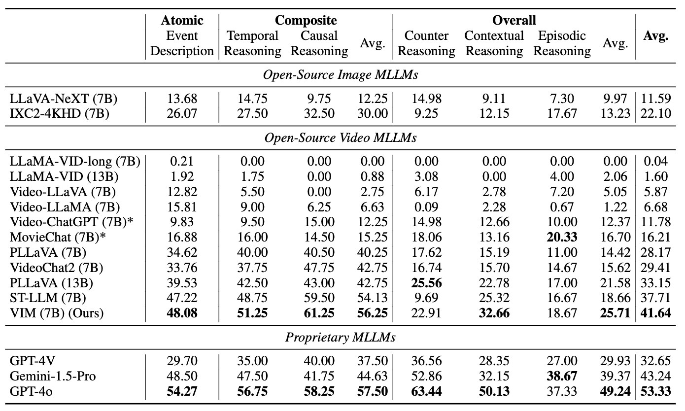

# Towards Event-oriented Long Video Understanding

 
 

 

<!-- <p align="center">
    
</p> -->


<font size=3><div align='center' > [[📖 arXiv Paper](https://arxiv.org/pdf/2406.14129)] [[📊 Dataset](https://huggingface.co/datasets/RUCAIBox/Event-Bench)]  </div></font>

---

## 🔥 News
* **`2024.06.20`** 🌟 Benchmark, evaluation code, training data, and model are released!


## 👀 Overview

We introduce **Event-Bench**, an event-oriented long video understanding benchmark built on existing datasets and human annotations. **Event-Bench** consists of three event understanding abilities and six event-related tasks, including 2,190 test instances to comprehensively evaluate the ability to understand video events.
<p align="center">
    
</p>


**Event-Bench** provides a systematic comparison across different kinds of capabilities for existing video MLLMs, and points out the major shortcomings of open-source MLLMs.


## 🔍 Benchmark Data and Instruction Dataset
Download the raw videos in EventBench from the [google drive link](https://drive.google.com/file/d/1wjjH2dK-KpaObFdS1yc-TBUTCvXsaLwc/view?usp=sharing).

Download the annotation of EventBench from the [huggingface link](https://huggingface.co/datasets/RUCAIBox/Event-Bench)

Download the merged video instruction dataset from the [google drive link](https://drive.google.com/file/d/1M9Nm2B-IGX8Y3x-A9XaUn6ND2CGlepde/view?usp=sharing)

**License**:
```
Event-Bench is only used for academic research. Commercial use in any form is prohibited.
```


## 🔮 Evaluation Pipeline
**Prompt**:

The common prompt used in our evaluation follows this format:

```
<QUESTION>
A. <OPTION1>
B. <OPTION2>
C. <OPTION3>
D. <OPTION4>
Answer with the option's letter from the given choices directly.
```


**Evaluation**: 

We recommend you to save the inference result in the format as [example_result.jsonl](./evaluation/example_result.jsonl). Once you have prepared the model responses in this format, please execute our evaluation script [evaluate_em.py](./evaluation/evaluate_em.py), and you will get the accuracy scores. 


```bash
python evaluate_em.py \
    --path $RESULTS_FILE
```

If you want to use GPT-4-turbo for evaluation, please use the following script [evaluate_gpt.py](./evaluation/evaluate_gpt.py).

```bash
python evaluate_gpt.py \
    --input_file $INPUT_FILE \
    --output_file $OUTPUT_FILE 
```

## 📈 Experimental Results
- **Evaluation results of different Video MLLMs.**

<p align="center">
    
</p>


## Citation

If you find our work helpful for your research, please consider citing our work.   

```bibtex
@misc{du2024eventoriented,
    title={Towards Event-oriented Long Video Understanding},
    author={Yifan Du and Kun Zhou and Yuqi Huo and Yifan Li and Wayne Xin Zhao and Haoyu Lu and Zijia Zhao and Bingning Wang and Weipeng Chen and Ji-Rong Wen},
    year={2024},
    eprint={2406.14129},
    archivePrefix={arXiv},
    primaryClass={cs.CV}
}
```